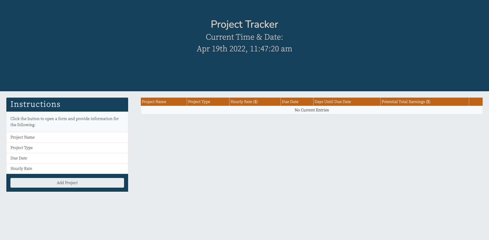

# Project Tracker

## [Site](https://josiemald.github.io/project-tracker/)

## [Repository](https://github.com/JosieMald/project-tracker)



### Project:
```
Created a project tracker application using Bootstrap, jQuery, jQueryUI, Moment, and Google Fonts.

* Bootstrap was used for design and responsiveness.

* jQuery set up functionality to capture form's input elements on submit to dynamically create a new table row on the page as well as event delegation to remove a row.

* jQueryUI was used for datepicker, dialog form, and select drop-down.

* Moment was used to display current time and date as well as calculating due date.
```

### Description
```
As a user you are able to add, remove, and track your current projects. After inputting your project you are able to see how many days you have left to complete the project and your potential total earnings (hourly wage at 8 hours per day multiplied by the number of days until the due date). As a user you are able to delete projects as they are completed. 
```
